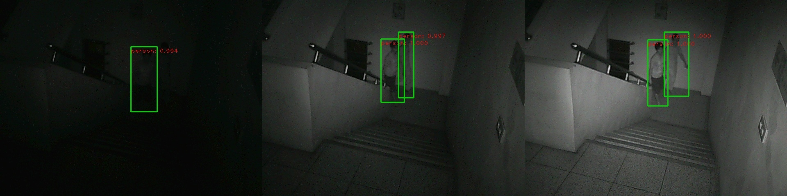

# faster RCNN pytorch

## setting
* python 3.6
* pytorch-1.0 (for pytorch-0.4 please see [original project](https://github.com/jwyang/faster-rcnn.pytorch))

### data preparation
* training data: data/<training_dataset>
* pretrained model: data/pretrained_model/<backbone_>_caffe.pth

### output folder
* detection results(BBs in txt): output/<output_name>/detection_results
* detection results(images): output/<output_name>/output_images
* output models: models/<backbone_>/<training_dataset>/


## train
```
python trainval_net.py --dataset MI3 --net vgg16 --bs 24 --nw 2 --lr 0.01 --lr_decay_step 10 --cuda --epochs 20
```

## test
```
python demoRGB.py  --net vgg16 --checksession 1 --checkepoch 20 --checkpoint 76 --cuda --load_dir models --image_dir /work/superorange5/MI3_dataset_ch6/Img_Sep/test_img/ --output_folder mi3_ch6 --vis
```

## demo

### object
* Bus


* Staircase


* Room


### face
* Pathway2_3

<br>


## Authorshihp
* original project: https://github.com/jwyang/faster-rcnn.pytorch
* This project is created by [Jianwei Yang](https://github.com/jwyang)  and [Jiasen Lu](https://github.com/jiasenlu), and modified by Peggy Lu

## Cite
```
@article{jjfaster2rcnn,
    Author = {Jianwei Yang and Jiasen Lu and Dhruv Batra and Devi Parikh},
    Title = {A Faster Pytorch Implementation of Faster R-CNN},
    Journal = {https://github.com/jwyang/faster-rcnn.pytorch},
    Year = {2017}
}

@inproceedings{renNIPS15fasterrcnn,
    Author = {Shaoqing Ren and Kaiming He and Ross Girshick and Jian Sun},
    Title = {Faster {R-CNN}: Towards Real-Time Object Detection
             with Region Proposal Networks},
    Booktitle = {Advances in Neural Information Processing Systems ({NIPS})},
    Year = {2015}
}
```
